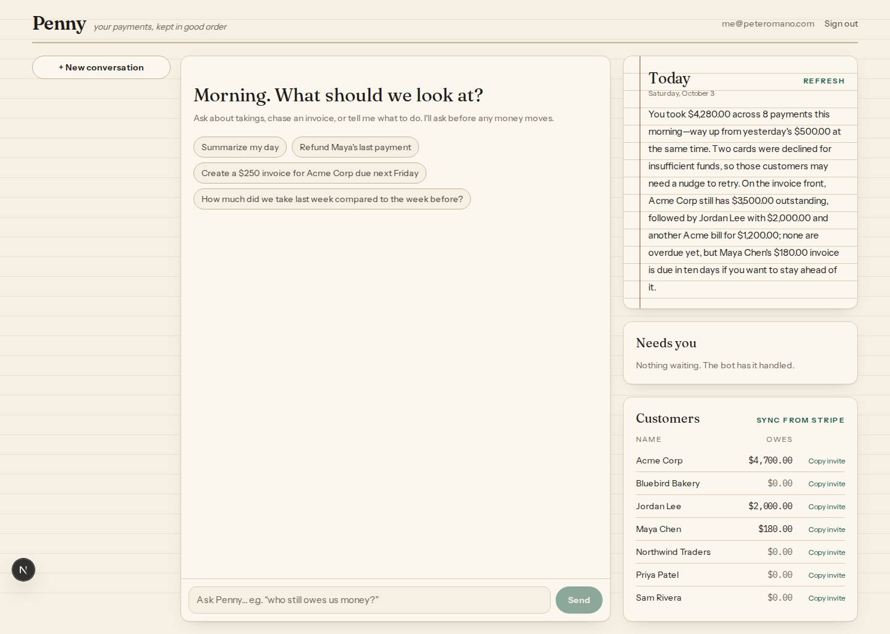
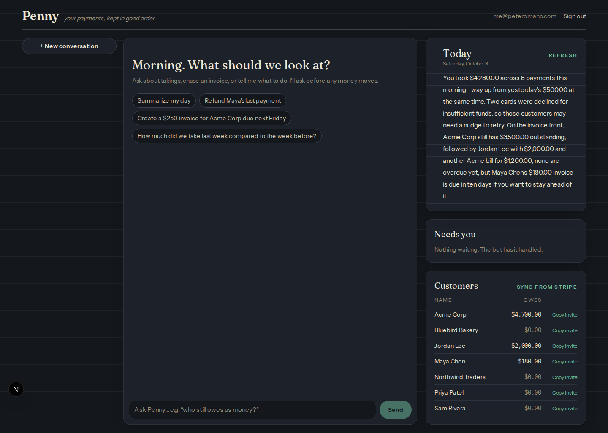
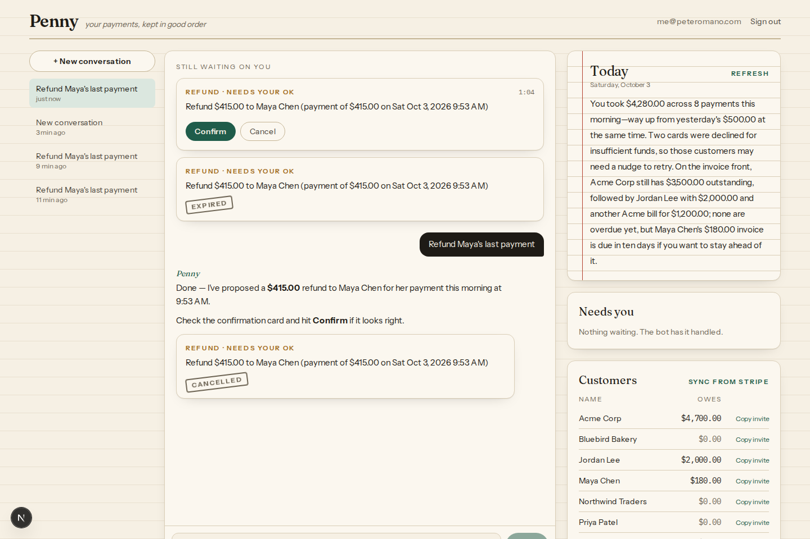
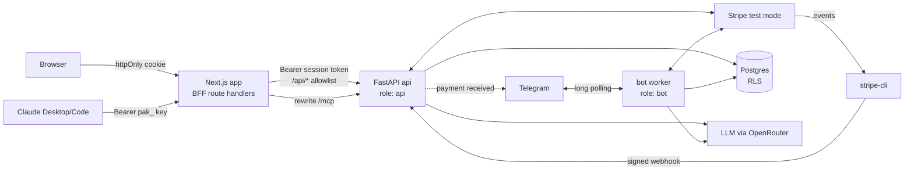

# Penny: an AI Payments Assistant

Penny helps a small business owner manage the money flowing through their Stripe account. It has three surfaces:

- **Owner web app.** A chat that summarizes the day ("You took $4,280.00 across 8 payments…") and carries out natural-language commands: *"Refund Maya's last payment"*, *"Create a $250 invoice for Acme Corp due next Friday"*, *"How much did we take last week compared to the week before?"*. Anything that moves money becomes a **proposal card** the owner confirms with a button.
- **Customer Telegram bot.** External customers see and pay **only their own** invoices. Payments of **$2,000 or more** are never completed by the bot; they're handed to the owner.
- **Bonus: an owner MCP server.** The same tools and guardrails from Claude Desktop or Claude Code, authenticated with revocable API keys.



| | |
|---|---|
|  |  |

Assumptions, challenges, limitations and the bonus rationale are in **[write-up.md](write-up.md)**. The design docs are in [`docs/v0/`](docs/v0/): [spec](docs/v0/spec.md), [plan](docs/v0/plan.md), [definition of done](docs/v0/goal.md) and [build log](docs/v0/progress.md).

---

## Quick start

Everything runs in Docker. The host needs only **Docker (Compose v2)** and **git**.

### 1. Get four credentials

| Service | What to do | `.env` key |
|---|---|---|
| **Stripe** | Create an account, stay in **test mode**, then copy the secret key (Developers → API keys) | `STRIPE_SECRET_KEY=sk_test_…` |
| **OpenRouter** | Create an account, add a few dollars of credit, create a key | `OPENROUTER_API_KEY=sk-or-…` |
| **Telegram** | Message [@BotFather](https://t.me/BotFather), send `/newbot`, copy the token and the bot's username | `TELEGRAM_BOT_TOKEN`, `TELEGRAM_BOT_USERNAME` (without the `@`) |

You don't need a Stripe webhook endpoint in the dashboard. The `stripe-cli` container forwards events with your API key and writes its signing secret to a shared volume, so nothing is copied by hand.

### 2. Configure

```bash
cp .env.example .env
# edit .env: the four values above, plus OWNER_EMAIL / OWNER_PASSWORD (your web login)
```

All other settings have defaults. Ports, database and wiring defaults live in `docker-compose.yml`; tuning knobs live in the app's settings.

### 3. Run

```bash
docker compose up --build -d
```

| URL | What |
|---|---|
| http://localhost:3010 | Owner web app |
| http://localhost:3010/mcp | Owner MCP endpoint (needs an API key) |
| http://localhost:8010/docs | API docs (dev only) |

To change host ports, set `APP_HOST_PORT`, `API_HOST_PORT` or `POSTGRES_HOST_PORT` in `.env`.

### 4. Seed your Stripe test account

```bash
docker compose run --rm api uv run python -m payments_assistant.seed
```

The seed is **idempotent**: running it again creates nothing new. `--reset` deletes the seeded customers first. It creates:

- **Seven customers** (Maya Chen, Acme Corp, Bluebird Bakery, Jordan Lee, Northwind Traders, …).
- **Today:** 8 successful payments ($4,280) and 2 declined for insufficient funds.
- **Earlier activity:** yesterday, last week ($4,300) and the week before ($2,950), plus a partial refund.
- **Open invoices:**

  | Customer | Amount | Why |
  |---|---|---|
  | Acme Corp | $1,200 | The brief's example |
  | Acme Corp | $3,500 | Above the $2,000 handoff limit |
  | Jordan Lee | $2,000 | Exactly the boundary |
  | Maya Chen | $180 | Payable through the bot |

- **Database:** customer accounts, your owner login, a **Telegram invite link per customer**, and an **MCP API key** with ready-to-paste client config. All are printed at the end.

> Stripe can't backdate charges. Seeded payments carry `metadata.pa_occurred_at`, which the app uses as the payment date so that "today vs yesterday" and "last week vs the week before" are meaningful. This is demo-only and explained in the write-up.

---

## Using each part

**Owner web app.** Sign in at http://localhost:3010 with `OWNER_EMAIL` / `OWNER_PASSWORD`. Then:

- **Today** streams the daily summary.
- **Chat** takes natural-language commands; try the suggested prompts.
- **Proposal cards:** refunds, invoices and payment links appear as cards with a 10-minute countdown. Nothing happens in Stripe until you press **Confirm**.
- **Needs you** lists customer handoffs, such as payments of $2,000 or more.
- **Customers** shows balances and has **Copy invite** (a Telegram link).
- **Connect Claude** creates MCP keys.

**Customer bot.** Open a customer's invite link (from the seed output or **Copy invite**) in Telegram and press Start. Try:

- "what do I owe?"
- "pay it": you get Stripe's secure invoice page. Pay with test card `4242 4242 4242 4242`, any future date and any CVC. Seconds later the webhook sends **"Payment received ✅"**.
- With Jordan or Acme's $3,500 invoice: the bot refuses and creates a handoff, which appears under **Needs you**.
- "show me Acme Corp's invoices" or "how much revenue did the business make?": politely refused, and nothing leaks.
- `/logout` unlinks the account.

**MCP (Claude Code):** create a key in **Connect Claude** (or `docker compose run --rm api uv run python -m payments_assistant.keys create --name me`), then:

```bash
claude mcp add --transport http penny http://localhost:3010/mcp --header "Authorization: Bearer pak_…"
```

Claude Desktop config (via `mcp-remote`) is shown next to each new key.

---

## Architecture



| Piece | Stack | Notes |
|---|---|---|
| `app/` | Next.js 16, React 19, Tailwind 4, Bun | The only public edge. Route handlers act as a BFF: the session token stays in an httpOnly cookie, and the browser never talks to Python. |
| `api/` → `api` | FastAPI, SQLAlchemy 2 (async), Alembic, Pydantic v2, uv | Owner API, SSE chat, Stripe webhooks, owner MCP. Postgres role `api`. |
| `api/` → `bot` | python-telegram-bot | Customer bot. Postgres role `bot`, confined by row-level security to one customer per transaction. |
| `postgres` | Postgres 16 | Least-privilege roles, `FORCE ROW LEVEL SECURITY` on customer-scoped tables, `SECURITY DEFINER` identity functions. |
| `stripe-cli` | `stripe listen` | Forwards test-mode events to `api:8000/webhooks/stripe`. |

**Core vs adapters.** `api/src/payments_assistant/core/` holds the models, services and tool registry, with no HTTP, Telegram or MCP code. `http/`, `bot/` and `mcp/` are thin adapters over it.

**One tool definition, three surfaces.** Each tool is defined once (`core/tools/`) with Pydantic input and output models. The web agent, the Telegram agent (customer tools) and the MCP server all use the same definitions.

### Privacy: three layers

1. **Tool binding.** Customer tools have no customer-identifying inputs; a test enforces this. The customer comes from the Telegram identity, and the Stripe gateway is bound to that one customer id and re-checks ownership of every object.
2. **Database role.** The bot connects as `bot`, which has grants only on customer-scoped tables.
3. **Row-level security.** Every customer-scoped table forces RLS on `customer_account_id = current_setting('app.customer_account_id')`. The setting is transaction-local, so with no scope set, queries return zero rows. A 61-case test suite runs as the `bot` role.

The **$2,000 rule** is enforced in code (`core/services/payments.py`), not in a prompt.

---

## API design

The Python API is internal: the browser reaches it only through Next's `/api/*` proxy. The proxy turns the cookie into a Bearer token, enforces an allowlist, checks the Origin header on writes, and streams responses unbuffered.

| Area | Endpoints |
|---|---|
| Auth | `POST /auth/login` (returns an opaque session token, of which only a hash is stored; the Next BFF puts it in the httpOnly cookie), `POST /auth/logout`, `GET /auth/me` |
| Chat | `POST/GET /conversations`, `GET /conversations/{id}`, `POST /conversations/{id}/messages` (SSE stream) |
| Actions | `GET /actions` (pending), `POST /actions/{id}/confirm`, `POST /actions/{id}/cancel` |
| Summary | `POST /summaries/today` (SSE, cached per day, invalidated by webhooks), `GET /summaries/today` |
| Owner ops | `GET /handoffs`, `POST /handoffs/{id}/acknowledge`, `POST /handoffs/{id}/resolve`, `GET /customers`, `POST /customers/{id}/invite`, `POST /customers/sync`, `GET/POST/DELETE /api-keys` |
| Integrations | `POST /webhooks/stripe` (signature verified, idempotent), `/mcp` (streamable HTTP, API key) |

Design choices:

- **Proposals, not actions.** The LLM can only create `owner_actions` rows. Executing one needs a human confirm, carries a Stripe idempotency key, and is audited.
- **SSE event contract** for streaming: `message_start`, `token`, `tool_start`, `tool_end`, `action_proposed`, `message_end`, `error`. The user's message is saved before streaming starts. The reply is saved even if the browser disconnects, marked `interrupted`.
- **Opaque sessions over JWTs.** Logout really revokes, and the token never reaches browser JavaScript.
- **Money is integer cents.** The LLM receives pre-formatted amounts and never does arithmetic. Date ranges ("last week", "next Friday") are resolved in code in `BUSINESS_TIMEZONE`.
- **LLM is configurable** with `LLM_MODEL=provider:model`; the default is `openrouter:moonshotai/kimi-k2.6`.

---

## Tests

```bash
# Python: unit + integration (real Postgres; a throwaway database per run)
docker compose run --rm api-test uv run pytest -m "not llm_eval and not stripe"
# against your real Stripe test account (creates and cleans up throwaway objects)
docker compose run --rm api-test uv run pytest -m stripe
# LLM evals against the real model (costs a few cents)
docker compose run --rm api-test uv run pytest -m llm_eval
# lint
docker compose run --rm api-test sh -c 'uv run ruff check . && uv run ruff format --check .'
# frontend: unit/component tests, lint, typecheck
docker compose run --rm app sh -c 'bun run test && bun run lint && bun run typecheck'
```

At submission there were over 400 Python tests and 72 Vitest tests, with about 94% coverage on core, HTTP and MCP. Notable suites:

- **Row-level security, as the `bot` role:** isolation, `WITH CHECK`, no scope leaks between transactions, and denial of owner tables.
- **Customer bot:** the $2,000 boundary at 199,999 / 200,000 / 200,001 cents, and cross-customer injection attempts.
- **Owner flows:** proposals and confirmation, the SSE event order and disconnects, and webhook signatures and idempotency.
- **MCP:** a real MCP client session.
- **Proxy:** the BFF's CSRF and header handling.

Development notes for contributors (and AI agents) are in [CLAUDE.md](CLAUDE.md).
